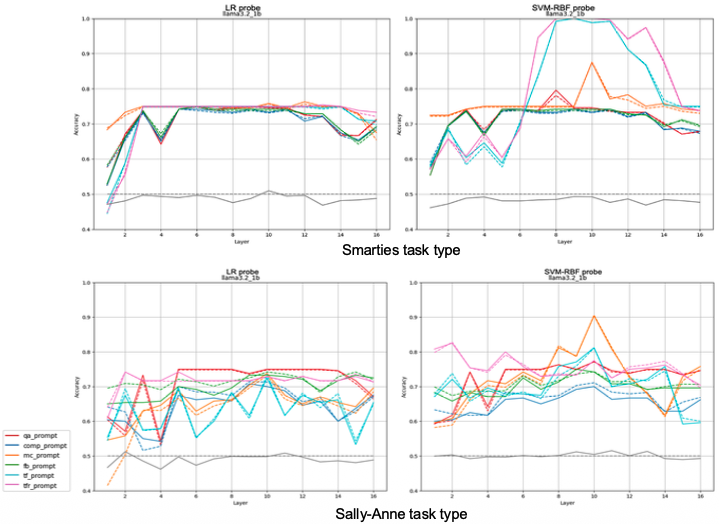
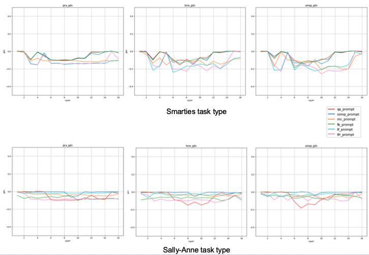
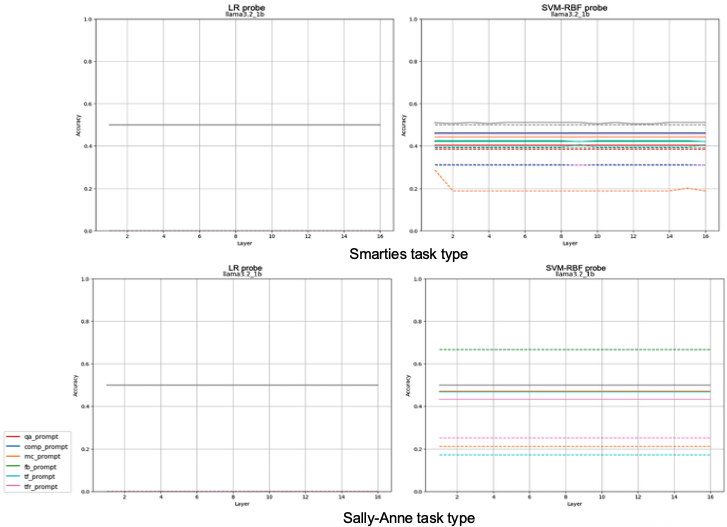
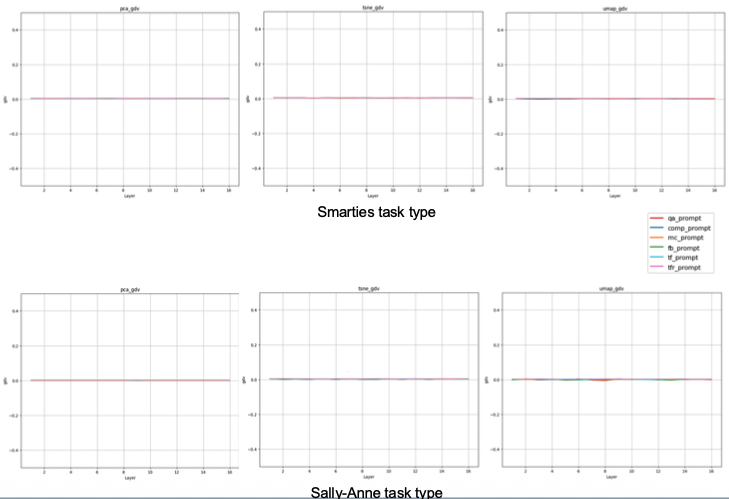
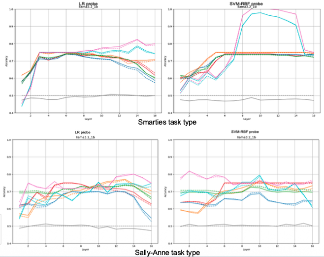
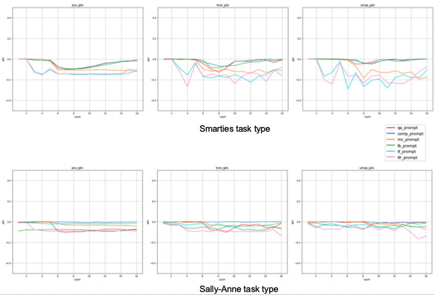

# belief-representation-llm

## Overview:

This repository contains the source code for running experiments conducted, as part of the Master Thesis work - **Layer-wise Analysis of Belief Representation in Transformer Language Model**.

## Key Contribution:

### Layer-wise analysis of belief representations

Performed a systematic, layer-wise investigation of how false-belief information is encoded across transformer components, including multi-head self-attention (MHSA), feed-forward networks (FFN), and residual-connected hidden states.

### Probing-based evaluation of belief encoding

Applied both linear (logistic regression) and non-linear (SVM with RBF kernel) probing methods to analyze whether internal activations encode distinguishable false-belief states (correct vs. incorrect).

### Geometric analysis using GDV

Applied the Generalized Discrimination Value (GDV) to measure the geometric separability of belief states in high-dimensional activation space, providing a complementary metric to standard classification performance.

### Use of controlled Theory of Mind benchmarks

Used the ToMChallenge dataset, based on canonical false-belief paradigms (Sally-Anne and Smarties tasks), to evaluate belief encoding under controlled and varied prompt conditions.

## Key Findings

1. _Belief representations are weak and fragmented_ : False-belief information is present but inconsistently encoded, providing only partial evidence for coherent internal representations.
2. _Encoding is concentrated in attention and residual pathways_ : Belief-related signals primarily emerge in mid-to-late attention layers and persist through the residual stream, with minimal contribution from feed-forward networks.
3. _Representations exhibit non-linear structure_ : Belief states are not cleanly separable using linear methods, but become distinguishable under non-linear analysis, indicating complex underlying geometry.
4. _Encoding is highly context and prompt-dependent_ : The clarity of belief representations varies significantly with input structure, with more structured prompts and certain task types yielding stronger signals.

### Visualization

_Belief-state accuracy across layers in MHSA, showing strongest signals in mid-to-late attention layers._

_Belief-state separability (GDV) across layers in MHSA, showing strongest signals in mid-to-late attention layers._

_Belief-state accuracy across layers in FFN, showing no signals across layers._

_Belief-state separability (GDV) across layers in FFN, showing no signal across layers._

_Belief-state accuracy across layers in residual stream (HS), showing strongest signals in mid-to-late attention layers._

_Belief-state separability (GDV) across layers in residual stream (HS), showing strongest signals in mid-to-late attention layers._

## How to Run:

To execute the code, follow these steps:

1. Update the local repository path and HuggingFace token in the configuration file, _config.yaml_.
2. Install all required packages using the provided _requirements.txt_ file.
3. Run _runPipeline.py_ file.

All plots will be generated in the output directory.

## Module Details:

### hfLM.py

The EvalLLM class is responsible for model initialization and activation extraction. It loads the LLaMA 3.2 1B Instruct model using HuggingFace's AutoModelForCausalLM and wraps it with nnsight's LanguageModel, enabling structured access to internal transformer activations. For each input prompt, the class extracts last-token activations from all sublayers, namely, self-attention, ffn, and residual hidden states and stores them in .npy files along with their corresponding labels, organized by layer.

### visualisingResults.py

The Visualize class handles all result-visualization components of the analysis. It plots probe accuracies across layers to compare prompt performance. It also performs dimensionality reduction using PCA, t-SNE, and UMAP to project high-dimensional activations into 2D space. Cluster separability is quantified using the GDV, computed from the reduced embeddings and labels. The class generates GDV summaries and 2D scatter plots to illustrate activation structure across sublayers and prompt types.

### probing.py

The Probing class performs all probe-based evaluations. It loads layer-wise activations and trains both, linear probes (logistic regression with 5-fold cross-validation) and nonlinear probes (SVM with RBF kernel, also cross-validated). Mean accuracy and F1 scores for them are recorded. A permutation-control baseline is included by shuffling labels and re-running both probes to measure chance-level performance. All metrics are saved into structured dictionaries and exported to CSV for later analysis.

### Dataset.py

The main class, Dataset, manages the loading and construction of the Smarties and Sally–Anne datasets. Each dataset is read from its CSV file in the data directory, which contains story contexts, prompt-type questions, and ground-truth answers. The class also handles prompt construction, combining each story with its associated question and answer Labels (correct vs. incorrect belief state) are also assigned here so that every prompt is paired with a classification target.

### gdv.py

This module implements the computation of the GDV using dimensionality-reduced activations and their labels. It quantify how well different belief states separate within the embedding space.

### runPipeline.py

This script serves as the main driver of the entire process, coordinating dataset loading, activation extraction, probing, GDV computation, and visualization in a unified pipeline.
